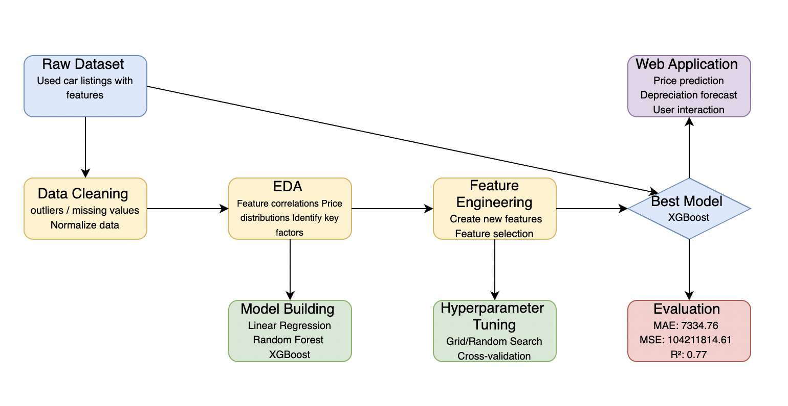
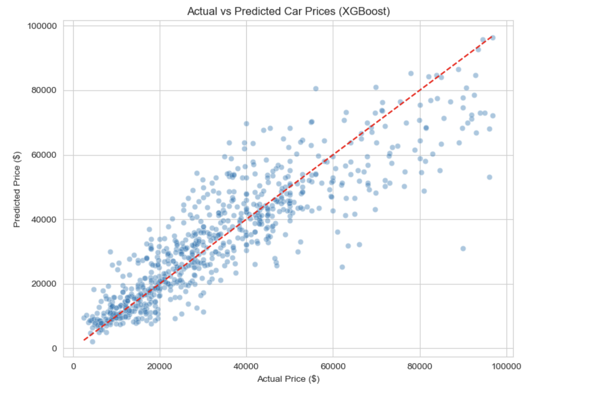

# Predicting Used Car Prices and Depreciation Using Machine Learning

## Authors
Yuan Wei

## Abstract

This project addresses the challenge of pricing used vehicles by applying machine learning to predict both current market values and future depreciation. Used car pricing is often inconsistent due to the interplay of multiple factors like brand, mileage, year, and condition. We use a dataset of over 4,000 car listings scraped from cars.com, combined with XGBoost modeling and a web interface. The final product is a fully functional Flask application that takes user input and returns real-time car value and depreciation predictions.

## Introduction

Used car valuation plays a critical role in consumer decision-making, dealer pricing, and auto financing. However, the pricing process is often subjective and non-transparent. Machine learning provides a data-driven way to analyze vehicle attributes and estimate value. Our project aims to improve car price transparency through a predictive model supported by a user-friendly web interface. Prior research often used linear models or relied on limited public datasets. Our contribution is to combine a powerful regression algorithm (XGBoost) with real-world data and interactive deployment.

This project aims to:

- Predict the current market price of a used car
- Forecast future depreciation over 1 to 5 years
- Provide a web-based tool for consumer interaction

## Dataset

- Source: [cars.com](https://www.cars.com/)
- Size: Approximately 4,000 listings
- Features: model year, milage, accident history, title status, brand, model, fuel type, transmission, exterior and interior colors, etc.
- Target: price 

## Methods

- Data Source: A CSV file scraped from cars.com (~4,000 entries)
- Data Cleaning: Removed rows with missing or invalid `price`, `model`, `brand`. Cleaned price strings, converted types, and filtered out unreasonable values.
- Feature Engineering:
  - Derived `car_age = 2025 - model_year`
  - One-hot encoded categorical fields: `brand`, `model`, `fuel_type`, `transmission`, `ext_col`, `int_col`
- Modeling:
  - Tested Linear Regression, Random Forest, and XGBoost
  - Used RandomizedSearchCV to tune XGBoost parameters
  - Simulated depreciation targets (`price_1y` to `price_5y`) with multipliers: 85%, 70%, 60%, 50%, 40%
- Deployment: Created a Flask app that reads user inputs, constructs a feature vector using the saved `features.pkl`, loads the trained models, and displays the results.

## Experimental Results

### Price Prediction
- MAE: $7,097
- R² Score: 0.79

### Depreciation Forecast (Years 1-5)
- MAE: ranges from ~$6,751 (1-year) to ~$3,177 (5-year)
- R²: ~0.74
- MAPE: ~29.32% across years

### Top Features by Importance
1. Milage
2. Model
3. Brand
4. Car Age

### Web App Evaluation
Tested the model with different vehicles including:
- 2020 BMW X5 $31417.04
- 2015 BMW 650 $25274.01

## Discussion
The machine learning model demonstrates high accuracy in pricing estimation and simulated depreciation. This tool can be valuable to:
- Car buyers (ensuring they’re not overpaying)
- Sellers/dealers (pricing competitively)
- Loan officers (assessing residual value)

What could be improved about the project in future work:
- Improve the accuracy of the model, it's still not accurate enough now

## Statement of Contributions

Yuan Wei

## References

1. cars.com. "New & Used Cars for Sale". https://www.cars.com
2. Kaggle. "Used Car Price Prediction". https://www.kaggle.com/
3. Chen, T., & Guestrin, C. (2016). "XGBoost: A Scalable Tree Boosting System." ACM SIGKDD.

## Appendix

Project files include:

- `app.py`: Flask web server
- `index.html`: front-end form
- `data_prepare.ipynb`: data cleaning and modeling notebook
- `xgb_price_model.pkl`: trained XGBoost model for price
- `xgb_dep_1y.pkl` to `xgb_dep_5y.pkl`: trained models for depreciation
- `features.pkl`: feature vector template
- `used_cars.csv`: cleaned dataset (if shared)

